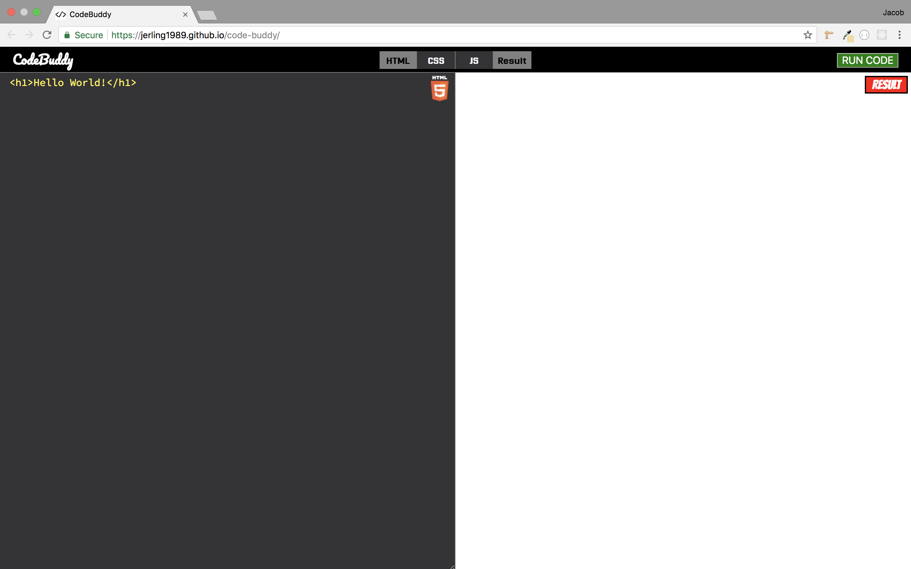
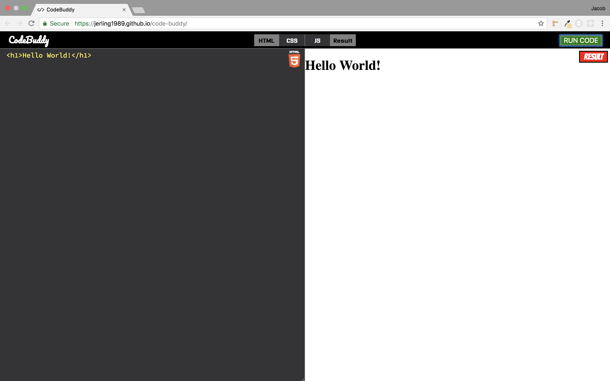
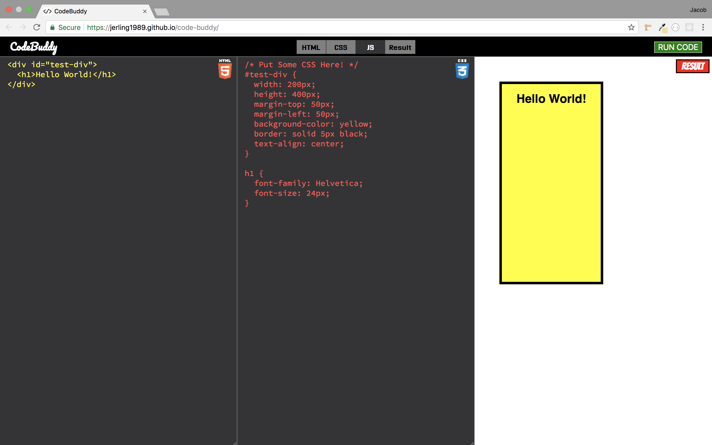
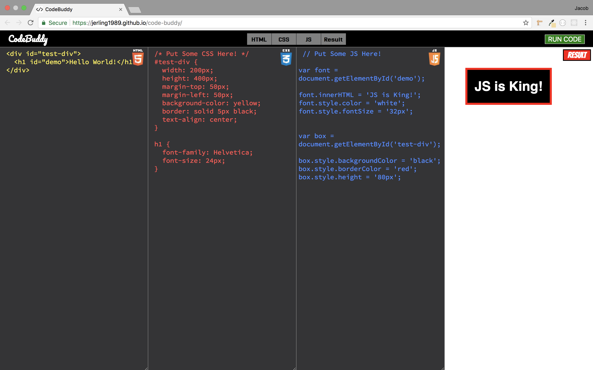

# code-buddy
For this project I made my own version of web apps like "CodePen" or "JS Bin". I used HTML, CSS, JavaScript, and jQuery to build out the design and functionality of the app. I had a lot of fun tinkering with several design aspects of the site including things like the different code colors, container badges, background color, logo, and more.

---

- This first image shows what the user will see upon first loading the site. The only two tabs that are automatically open upon page load are the HTML Container and the Results Container. The HTML code is prefilled with the traditional "Hello World!" output.

